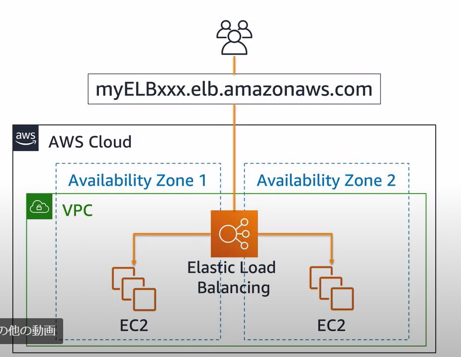
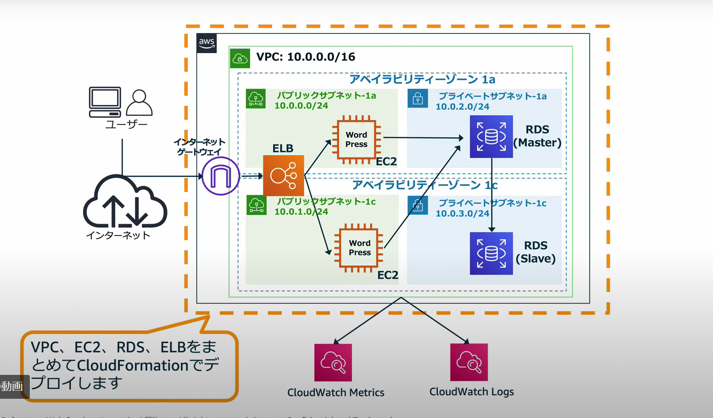

# 前提となる知識（知らなかった。）

## 3.Elastic Load Balancing(ELB)

知らない。触ったこともないので調べる。

オンプレミスの「L4/L7ロードバランサ」に相当

複数EC2インスタンスに負荷分散

高い耐障害性を実現

ELBの性能増減は自動的に実施

複数AZをつなぐ

## 5.AWS CloudFormation
知らない。触ったこともないので調べる。

シンプルなテキストファイル（テンプレート）を使用して、

リージョンとアカウントでアプリケーションに必要とされるAWSリソースをプロビジョニングできるサービス

例：EC2+RDS+VPCを作成する

スタックとは単一のユニットとして管理できるＡＷＳリソースのコレクション。
ＡＷＳリソース＝EC2 S3 RDSのようなサービス

https://docs.aws.amazon.com/ja_jp/AWSCloudFormation/latest/UserGuide/stacks.html

# 前提となる知識（知ってる）

## 1.VPC（）

知ってる。触ったことがあるのでパス

## 2.EC2

知ってる。触ったことがあるのでパス

## 4.amazon RDS
知ってる。触ったこともあるのでパス

# 事前準備

実作業-AWS CloudFormationでサービスなどを作成する。

1.テンプレートURLを指定
２．スタックを指定する。

→他の人が実施済みなので自分ではやらない

# 参考

https://www.youtube.com/watch?v=nM5GvCtGu1M&t=725s

